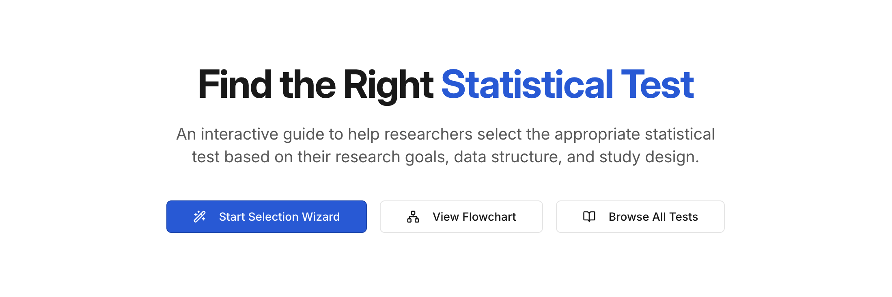
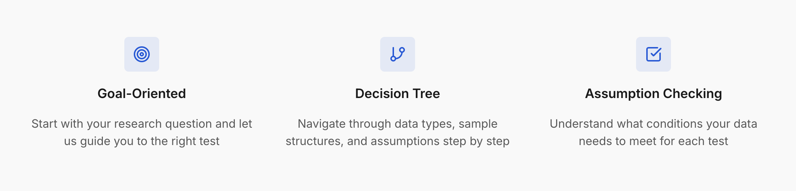
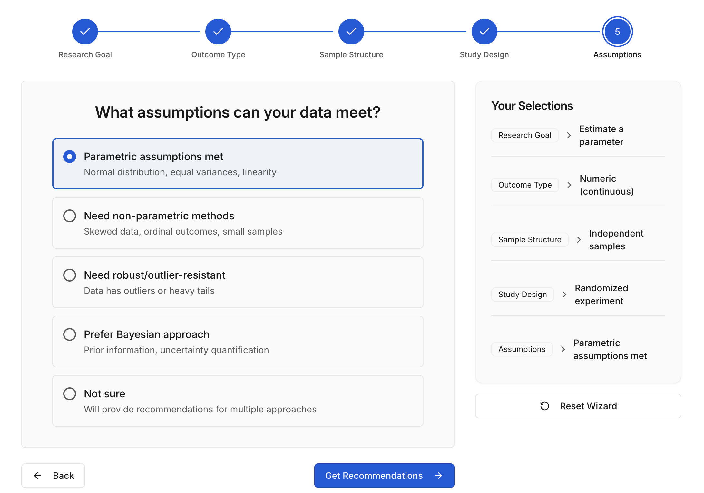
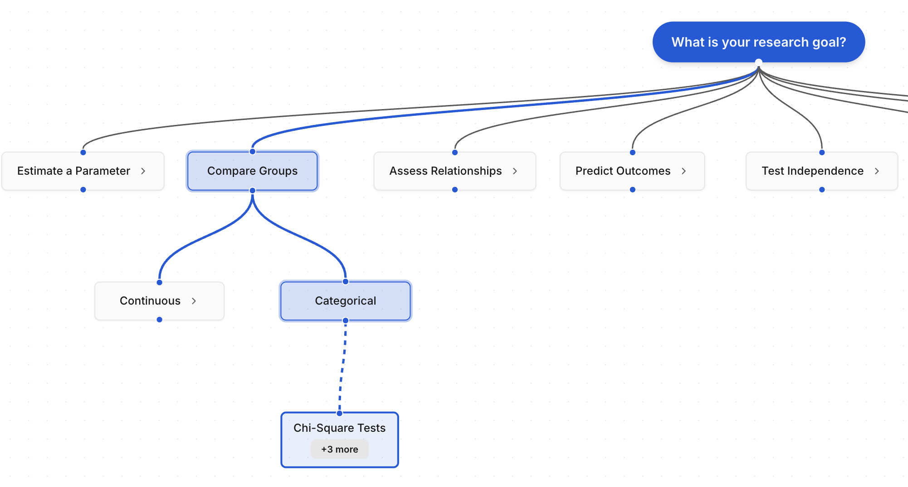
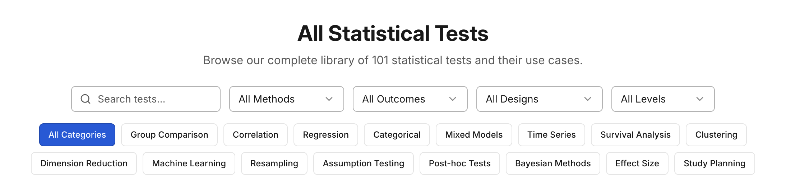
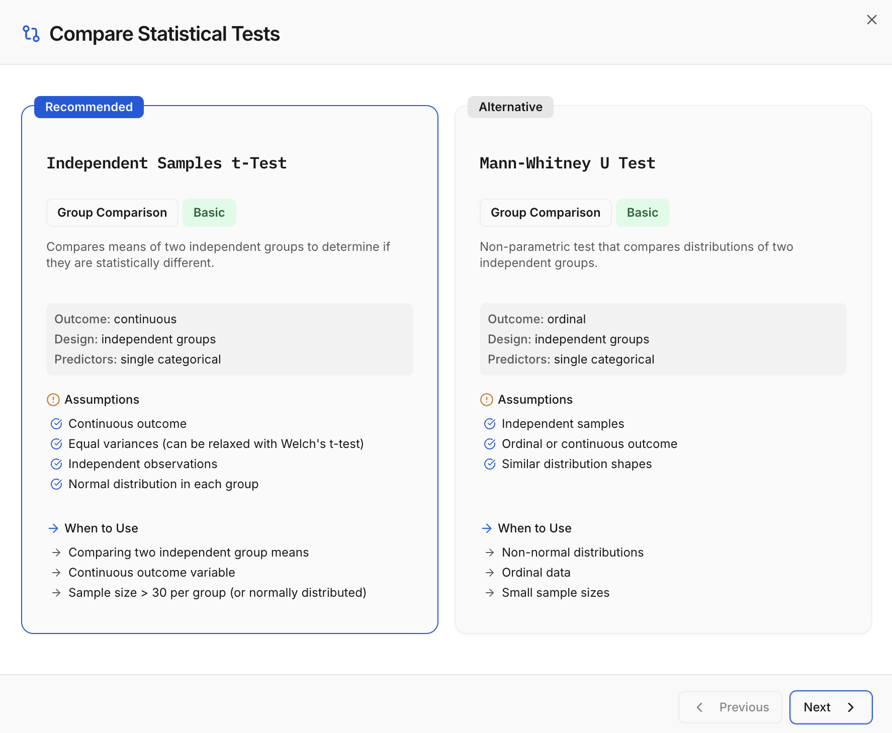
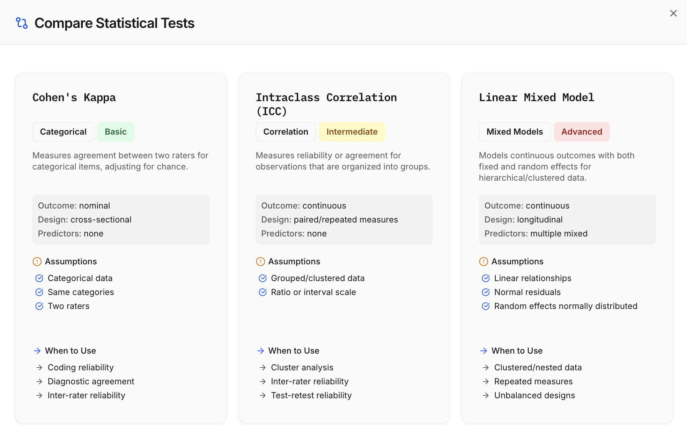

# StatsTree

**StatsTree** is an interactive, web-based decision tool designed to help researchers, students, and analysts select the most appropriate statistical test based on their research goals, data structure, and study design.

🌐 **Site:** https://stats-tree.replit.app
  - May or may not be live at the time of reading

📦 **Offline package:** [./dist-offline/statstree-offline.html](./dist-offline/statstree-offline.html)
  - Download the HTML file and open it in any browser offline

---

## Overview

Selecting the correct statistical test is a foundational but frequently misunderstood step in research and data analysis. StatsTree simplifies this process by guiding users through a structured, assumption-aware decision tree that accounts for research objectives, variable types, sample structure, and modeling constraints.

The platform is designed to be intuitive, educational, and completely free to use.

---

## How It Works

### Goal-Oriented Selection
Users begin with their research question—such as comparing groups, testing relationships, or analyzing repeated measures—and are guided toward the appropriate class of statistical methods.

### Decision Tree Logic
StatsTree uses a step-by-step decision tree that evaluates:
- Outcome and predictor variable types
- Number of groups or samples
- Independence vs. pairing
- Distributional and modeling assumptions

### Assumption Awareness
Rather than treating statistical tests as interchangeable, StatsTree emphasizes **assumption checking**, helping users understand:
- When a test is valid
- When assumptions are violated
- Which alternative methods may be more appropriate

---

## Platform Features

### **Selection Wizard** — guided, question-based test selection

### **Flowchart** — visual representation of statistical decision logic  

### **Browse All Tests** — complete catalog of supported methods  

### **Compare** - recommendation alternatives or up to 3 tests of your choice

---

## Coverage

StatsTree currently includes:

Covered scenarios include:
- Parametric and non-parametric group comparisons
- Tests of association and independence
- Regression and predictive modeling
- Experimental and observational designs
- Paired, repeated-measures, and multivariate analyses

---

## Use Cases

StatsTree is intended for:
- Undergraduate and graduate students
- Academic researchers
- Data analysts and data scientists
- Educators and instructors
- Practitioners seeking a structured statistical decision workflow

---

## Tech Stack

### Frontend
- React 18 with TypeScript
- Vite (build tool with hot module replacement)
- Wouter (lightweight routing)
- TanStack Query (React Query) for data fetching and caching
- Tailwind CSS with CSS variables for theming
- shadcn/ui component library (built on Radix UI)
- Lucide React icons

### Backend
- Node.js with Express
- TypeScript using ES modules
- RESTful API architecture

### Data Layer
- Drizzle ORM (configured for PostgreSQL)
- Currently using in-memory storage (`MemStorage`)

### Styling & Theming
- Tailwind CSS
- Dark / light mode via CSS variables
- Google Fonts:
  - DM Sans
  - Inter
  - Fira Code

### Offline Packaging & Distribution
The application supports a fully offline, single-file deployment suitable for `file://` usage and air-gapped environments.

- **Vite**  
  Used as the primary bundler with a dedicated offline build configuration (`vite.static.config.ts`) that:
  - Uses a separate entry point (`main-offline.tsx`)
  - Sets a `VITE_OFFLINE_MODE` environment variable
  - Inlines all assets with a 100 MB limit
  - Outputs the build to `dist-offline/`

- **vite-plugin-singlefile**  
  A Vite plugin that inlines all JavaScript, CSS, and static assets into a single HTML file.  
  No external files or web server are required.

- **Wouter (`useHashLocation`)**  
  Uses Wouter’s built-in hash-based routing to enable client-side navigation via `#/path` URLs.  
  This routing strategy is compatible with the `file://` protocol, unlike traditional path-based routing.

This configuration enables the application to run entirely from a single HTML file while preserving full client-side routing and application functionality.

---

## Project Philosophy

StatsTree prioritizes:
- Correct statistical reasoning over rote memorization
- Transparency around assumptions and limitations
- Breadth of coverage across statistical methodologies
- Accessibility without paywalls or required accounts

The project is intended to function both as a **practical decision tool** and an **educational reference**.

---

## Acknowledgment & Related Work

This project acknowledges **Stat Tree™** (https://www.stat-tree.com) as a respected and well-established resource for statistical test selection.

Although Stat Tree™ was discovered late in the development of this project, it is important to recognize its contribution to the field. Stat Tree™ guides users through a structured series of decision points to identify the appropriate statistical test for a given hypothesis or research objective. It also provides linked **training videos and demonstrations** across multiple platforms, including **Julia, Python™, R, SAS®, SPSS™, Stata™, and Excel™**, making it a strong hands-on educational resource.

StatsTree was developed independently and with a different emphasis. In particular, this project focuses on:
- A broader breadth of statistical tests and categories
- Explicit assumption-driven decision logic
- A modern, web-native, interactive experience
- Serving as a general-purpose reference and selection guide rather than a software-specific tutorial platform

Stat Tree™ remains an excellent complementary resource, especially for users seeking platform-specific demonstrations, and its existence reinforces the importance of accessible tools that improve statistical decision-making.

---

## Roadmap

Planned and potential future enhancements include:
- Code examples for R and Python
- Downloadable decision cheatsheets
- Links to textbooks and primary references

---

## License

This project is **free to use** for educational and research purposes.
