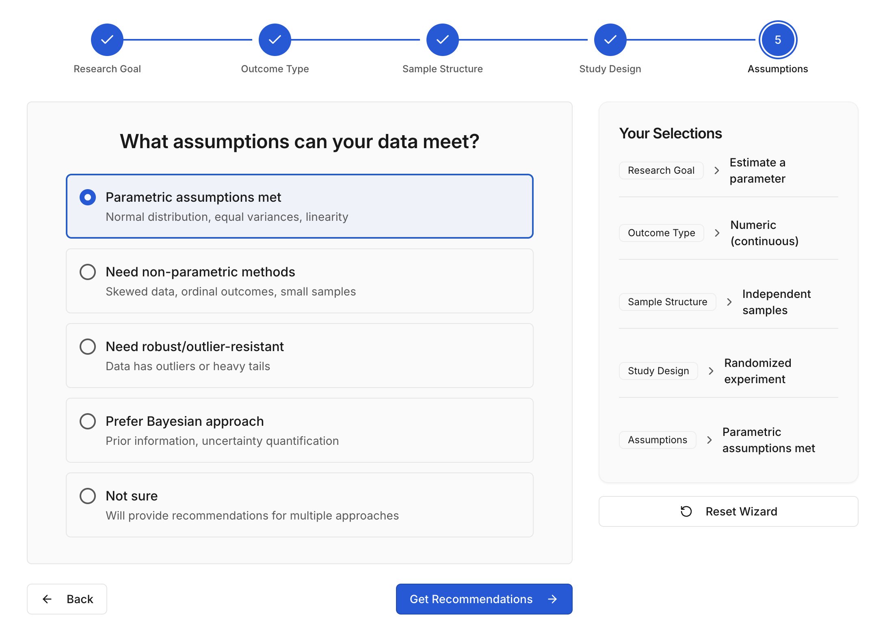
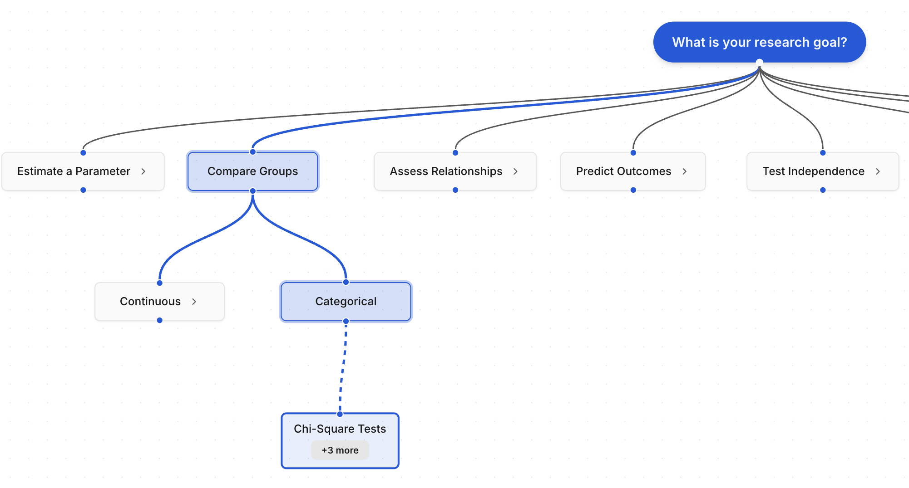
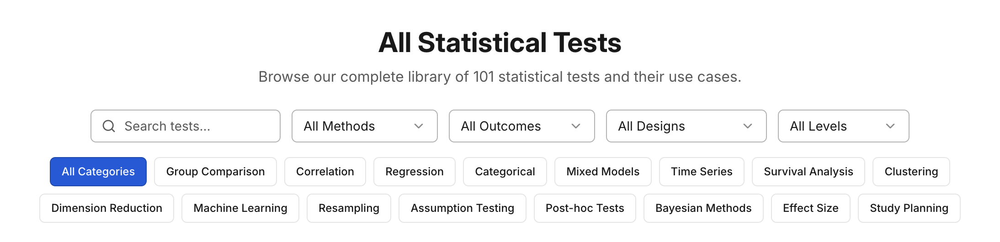

# StatSprig


StatSprig is an interactive statistical test selection and reference app built to help users find a reasonable starting point for an analysis, understand the assumptions behind common methods, and compare nearby alternatives without leaving the browser.

Live site: [statsprig.com](https://www.statsprig.com)

Download offline version: [docs/index.html](docs/index.html)

Current library:


## What It Does

StatSprig is designed for students, researchers, educators, analysts, and anyone who wants a faster way to move from a research question to a defensible method choice.

The current product includes:

### A guided wizard for test selection based on goal, outcome type, design, and structure
  

</br>

### A horizontally explorable decision tree for browsing the same logic more directly
  

</br>

### A searchable test library with filtering by category, outcome scale, and design
  

</br>

### Side-by-side comparison views for related methods and companion measures
  

</br>

### Detailed test cards with assumptions, use cases, related methods, and code examples
  

</br>

### Inline glossary support across the app, plus a dedicated glossary page
  

</br>

## Product Structure

Most of StatSprig's decision logic and content live in typed frontend data files rather than a live backend service:

- `client/src/lib/wizardKeys.ts` contains the decision flow and recommendation rules
- `client/src/lib/statsData.ts` contains the statistical test catalog and code snippets
- `client/src/lib/glossaryData.ts` contains glossary definitions and related terms

This keeps the app fast, portable, and suitable for both web deployment and offline usage.

## Running Locally

Prerequisites:

- Node.js 20+
- npm

Install dependencies:

```bash
npm install
```

Start the development server:

```bash
npm run dev
```

This starts the app on port `5000` by default.

Useful commands:

```bash
npm run check   # TypeScript type-check
npm run build   # Production build + static offline export
```

## Build Outputs

`npm run build` produces two deployment targets:

- `dist/` for the bundled server and standard production client assets
- `docs/index.html` as a fully inlined single-file build for offline use and GitHub Pages-style static hosting

The offline build uses hash-based routing so it can run directly from `file://` without a web server.

## Tech Stack

### Frontend

- React 18 + TypeScript
- Vite 5
- Wouter for routing, with a custom hash-router path for offline mode
- Tailwind CSS for styling and design tokens
- shadcn/ui components built on Radix UI primitives
- Lucide React icons
- Framer Motion for selected UI animation

### Content and presentation

- Typed TypeScript modules for decision rules, glossary data, and test metadata
- React Markdown for rich text rendering
- `remark-math` + `rehype-katex` for math support
- Prism-based code blocks for Python and R snippets
- CSS custom properties and a custom light/dark theme toggle persisted in `localStorage`

### Server and build pipeline

- Node.js + Express as the development and production host shell
- esbuild for bundling the server output
- `vite-plugin-singlefile` for the standalone offline export
- A dedicated static Vite config for generating the single-file `docs/` build

### Current architecture note

- The core StatSprig experience is currently client-driven
- The included server is mainly responsible for local development and production hosting
- The statistical catalog, glossary, and recommendation logic do not depend on a live database or API

## Project Goals

StatSprig aims to make statistical method selection more practical and less opaque by emphasizing:

- Reasonable starting-point recommendations instead of false certainty
- Assumption awareness instead of memorized test names
- Quick comparison between adjacent methods
- Free access without accounts or paywalls
- A usable experience for both beginners and experienced users

## Acknowledgment

- DOED Minority Science and Engineering Improvement Program (MSEIP) Grant#: P120A220015, "Boosting STEM Student Success"</li>
- Dr. Bernadette Hence at U.S. Department of Education</li>
- Dr. Mary Jo Parker, PI, MSEIP at University of Houston-Downtown</li>
- Dr. Katherine Shoemaker, Co-PI, MSEIP at University of Houston-Downtown</li>

<div style="display: flex; justify-content: center; align-items: center; gap: 24px; flex-wrap: wrap;">
    
    
</div>

## Related Work

StatSprig was developed independently, but projects such as [Stat-Tree](https://www.stat-tree.com) remain valuable adjacent resources for statistical test selection and statistical software walkthroughs. The broader goal is the same: make better statistical decision-making more accessible.

## License

This repository is currently marked as `MIT` in `package.json`.
